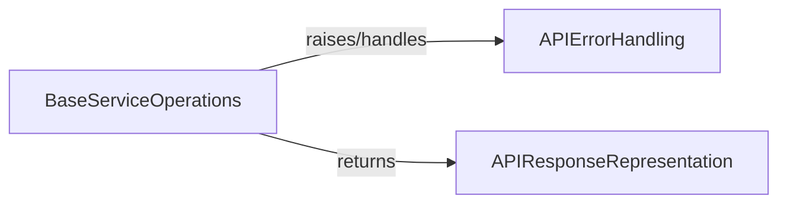

## Component Details

This subsystem is responsible for managing the structured representation of API responses and defining custom exceptions for handling errors returned by API calls. It provides detailed access to response information and a standardized way to report and handle API-related errors.

### APIErrorHandling
This component defines and manages custom exceptions for API interactions, encapsulating error details like status codes and messages, and providing methods to generate informative error messages from HTTP responses.

**Related Classes/Methods**:

- <a href="https://github.com/IBM/python-sdk-core/blob/master/ibm_cloud_sdk_core/api_exception.py#L24-L90" target="_blank" rel="noopener noreferrer">`python-sdk-core.ibm_cloud_sdk_core.api_exception.ApiException` (24:90)</a>
- <a href="https://github.com/IBM/python-sdk-core/blob/master/ibm_cloud_sdk_core/api_exception.py#L39-L48" target="_blank" rel="noopener noreferrer">`python-sdk-core.ibm_cloud_sdk_core.api_exception.ApiException:__init__` (39:48)</a>
- <a href="https://github.com/IBM/python-sdk-core/blob/master/ibm_cloud_sdk_core/api_exception.py#L70-L90" target="_blank" rel="noopener noreferrer">`python-sdk-core.ibm_cloud_sdk_core.api_exception.ApiException._get_error_message` (70:90)</a>

### APIResponseRepresentation
This component provides a structured representation of API responses, allowing access to response data, headers, and status codes. It includes methods for converting the response into a dictionary format for serialization or inspection.

**Related Classes/Methods**:

- <a href="https://github.com/IBM/python-sdk-core/blob/master/ibm_cloud_sdk_core/detailed_response.py#L23-L87" target="_blank" rel="noopener noreferrer">`python-sdk-core.ibm_cloud_sdk_core.detailed_response.DetailedResponse` (23:87)</a>
- <a href="https://github.com/IBM/python-sdk-core/blob/master/ibm_cloud_sdk_core/detailed_response.py#L86-L87" target="_blank" rel="noopener noreferrer">`python-sdk-core.ibm_cloud_sdk_core.detailed_response.DetailedResponse:__str__` (86:87)</a>
- <a href="https://github.com/IBM/python-sdk-core/blob/master/ibm_cloud_sdk_core/detailed_response.py#L76-L84" target="_blank" rel="noopener noreferrer">`python-sdk-core.ibm_cloud_sdk_core.detailed_response.DetailedResponse._to_dict` (76:84)</a>

### [FAQ](https://github.com/CodeBoarding/GeneratedOnBoardings/tree/main?tab=readme-ov-file#faq)