```mermaid
graph LR
    Authenticator_Factory["Authenticator Factory"]
    Base_Authenticator["Base Authenticator"]
    IAM_Request_Based_Authenticator["IAM Request Based Authenticator"]
    Simple_Authenticators["Simple Authenticators"]
    Specialized_Authenticators["Specialized Authenticators"]
    Base_Token_Manager["Base Token Manager"]
    JWT_Token_Manager["JWT Token Manager"]
    IAM_Request_Based_Token_Manager["IAM Request Based Token Manager"]
    Specialized_Token_Managers["Specialized Token Managers"]
    Authenticator_Factory -- "creates" --> Base_Authenticator
    Authenticator_Factory -- "creates" --> Simple_Authenticators
    Authenticator_Factory -- "creates" --> Specialized_Authenticators
    IAM_Request_Based_Authenticator -- "inherits from" --> Base_Authenticator
    Simple_Authenticators -- "inherits from" --> Base_Authenticator
    Specialized_Authenticators -- "inherits from" --> Base_Authenticator
    Specialized_Authenticators -- "inherits from" --> IAM_Request_Based_Authenticator
    Specialized_Authenticators -- "uses" --> Specialized_Token_Managers
    Base_Token_Manager -- "provides token management for" --> IAM_Request_Based_Authenticator
    Base_Token_Manager -- "provides token management for" --> Specialized_Authenticators
    JWT_Token_Manager -- "inherits from" --> Base_Token_Manager
    IAM_Request_Based_Token_Manager -- "inherits from" --> JWT_Token_Manager
    Specialized_Token_Managers -- "inherits from" --> Base_Token_Manager
    Specialized_Token_Managers -- "inherits from" --> JWT_Token_Manager
    Specialized_Token_Managers -- "inherits from" --> IAM_Request_Based_Token_Manager
    Specialized_Token_Managers -- "manages tokens for" --> Specialized_Authenticators
```

## Component Details

The Authentication Subsystem within the SDK is designed to provide a flexible and extensible framework for managing various authentication mechanisms. Its core purpose is to abstract the complexities of token acquisition and management, allowing different services to authenticate seamlessly. The main flow involves an Authenticator Factory that dynamically creates the appropriate Authenticator based on configuration. These Authenticators, which can be simple or specialized, then utilize Token Managers to acquire and refresh authentication tokens, ensuring secure and continuous access to IBM Cloud services.

### Authenticator Factory
This component is responsible for dynamically creating and returning the appropriate Authenticator instance based on configuration retrieved from environment variables or other external sources. It acts as a central entry point for obtaining an authenticator for a given service.

**Related Classes/Methods**:

- <a href="https://github.com/IBM/python-sdk-core/blob/master/ibm_cloud_sdk_core/get_authenticator.py#L1-L140" target="_blank" rel="noopener noreferrer">`ibm_cloud_sdk_core.get_authenticator` (1:140)</a>
- <a href="https://github.com/IBM/python-sdk-core/blob/master/ibm_cloud_sdk_core/get_authenticator.py#L37-L58" target="_blank" rel="noopener noreferrer">`ibm_cloud_sdk_core.get_authenticator:get_authenticator_from_environment` (37:58)</a>
- <a href="https://github.com/IBM/python-sdk-core/blob/master/ibm_cloud_sdk_core/get_authenticator.py#L63-L181" target="_blank" rel="noopener noreferrer">`ibm_cloud_sdk_core.get_authenticator.__construct_authenticator` (63:181)</a>

### Base Authenticator
This abstract component defines the fundamental interface and common constants for all authentication mechanisms within the SDK. It mandates the implementation of 'authenticate' and 'validate' methods, ensuring a consistent contract for how different authenticators interact with requests.

**Related Classes/Methods**:

- <a href="https://github.com/IBM/python-sdk-core/blob/master/ibm_cloud_sdk_core/authenticators/authenticator.py#L20-L60" target="_blank" rel="noopener noreferrer">`ibm_cloud_sdk_core.authenticators.authenticator.Authenticator` (20:60)</a>

### IAM Request Based Authenticator
This component serves as a foundational class for authenticators that rely on interacting with an IAM token service to obtain access tokens. It provides common logic for handling bearer token injection into requests, managing client credentials, and configuring SSL verification, headers, and proxies for token requests.

**Related Classes/Methods**:

- <a href="https://github.com/IBM/python-sdk-core/blob/master/ibm_cloud_sdk_core/authenticators/iam_request_based_authenticator.py#L27-L118" target="_blank" rel="noopener noreferrer">`ibm_cloud_sdk_core.authenticators.iam_request_based_authenticator.IAMRequestBasedAuthenticator` (27:118)</a>

### Simple Authenticators
This group includes authenticators that handle straightforward authentication methods like basic username/password or a direct bearer token. They do not typically involve complex token management or external token service interactions.

**Related Classes/Methods**:

- <a href="https://github.com/IBM/python-sdk-core/blob/master/ibm_cloud_sdk_core/authenticators/basic_authenticator.py#L28-L89" target="_blank" rel="noopener noreferrer">`ibm_cloud_sdk_core.authenticators.basic_authenticator.BasicAuthenticator` (28:89)</a>
- <a href="https://github.com/IBM/python-sdk-core/blob/master/ibm_cloud_sdk_core/authenticators/bearer_token_authenticator.py#L25-L85" target="_blank" rel="noopener noreferrer">`ibm_cloud_sdk_core.authenticators.bearer_token_authenticator.BearerTokenAuthenticator` (25:85)</a>

### Specialized Authenticators
This component encompasses various specific authentication implementations tailored for different IBM Cloud authentication flows, such as Container, Cloud Pak for Data, IAM, IAM Assume, VPC Instance, MCSP, and MCSPV2. Each handles the unique requirements of its respective authentication type, often delegating token acquisition to a specialized token manager.

**Related Classes/Methods**:

- <a href="https://github.com/IBM/python-sdk-core/blob/master/ibm_cloud_sdk_core/authenticators/container_authenticator.py#L24-L151" target="_blank" rel="noopener noreferrer">`ibm_cloud_sdk_core.authenticators.container_authenticator.ContainerAuthenticator` (24:151)</a>
- <a href="https://github.com/IBM/python-sdk-core/blob/master/ibm_cloud_sdk_core/authenticators/cp4d_authenticator.py#L28-L168" target="_blank" rel="noopener noreferrer">`ibm_cloud_sdk_core.authenticators.cp4d_authenticator.CloudPakForDataAuthenticator` (28:168)</a>
- <a href="https://github.com/IBM/python-sdk-core/blob/master/ibm_cloud_sdk_core/authenticators/iam_authenticator.py#L25-L110" target="_blank" rel="noopener noreferrer">`ibm_cloud_sdk_core.authenticators.iam_authenticator.IAMAuthenticator` (25:110)</a>
- <a href="https://github.com/IBM/python-sdk-core/blob/master/ibm_cloud_sdk_core/authenticators/iam_assume_authenticator.py#L26-L146" target="_blank" rel="noopener noreferrer">`ibm_cloud_sdk_core.authenticators.iam_assume_authenticator.IAMAssumeAuthenticator` (26:146)</a>
- <a href="https://github.com/IBM/python-sdk-core/blob/master/ibm_cloud_sdk_core/authenticators/vpc_instance_authenticator.py#L28-L125" target="_blank" rel="noopener noreferrer">`ibm_cloud_sdk_core.authenticators.vpc_instance_authenticator.VPCInstanceAuthenticator` (28:125)</a>
- <a href="https://github.com/IBM/python-sdk-core/blob/master/ibm_cloud_sdk_core/authenticators/mcsp_authenticator.py#L28-L134" target="_blank" rel="noopener noreferrer">`ibm_cloud_sdk_core.authenticators.mcsp_authenticator.MCSPAuthenticator` (28:134)</a>
- <a href="https://github.com/IBM/python-sdk-core/blob/master/ibm_cloud_sdk_core/authenticators/mcspv2_authenticator.py#L28-L270" target="_blank" rel="noopener noreferrer">`ibm_cloud_sdk_core.authenticators.mcspv2_authenticator.MCSPV2Authenticator` (28:270)</a>
- <a href="https://github.com/IBM/python-sdk-core/blob/master/ibm_cloud_sdk_core/authenticators/no_auth_authenticator.py#L20-L31" target="_blank" rel="noopener noreferrer">`ibm_cloud_sdk_core.authenticators.no_auth_authenticator.NoAuthAuthenticator` (20:31)</a>

### Base Token Manager
This abstract component provides the core logic for managing access tokens, including mechanisms for checking token expiration, refreshing tokens, and handling concurrent token requests. It defines the fundamental contract for how token managers acquire and maintain valid tokens.

**Related Classes/Methods**:

- <a href="https://github.com/IBM/python-sdk-core/blob/master/ibm_cloud_sdk_core/token_managers/token_manager.py#L31-L216" target="_blank" rel="noopener noreferrer">`ibm_cloud_sdk_core.token_managers.token_manager.TokenManager` (31:216)</a>

### JWT Token Manager
This component extends the Base Token Manager to specifically handle JSON Web Tokens (JWTs). It includes logic for decoding JWTs to extract expiration and issuance times, which are crucial for determining token validity and refresh schedules.

**Related Classes/Methods**:

- <a href="https://github.com/IBM/python-sdk-core/blob/master/ibm_cloud_sdk_core/token_managers/jwt_token_manager.py#L27-L91" target="_blank" rel="noopener noreferrer">`ibm_cloud_sdk_core.token_managers.jwt_token_manager.JWTTokenManager` (27:91)</a>

### IAM Request Based Token Manager
This component builds upon the JWT Token Manager to provide common functionality for token managers that interact with the IBM Cloud IAM service. It manages IAM-specific request parameters such as client ID/secret, custom headers, and proxy configurations, streamlining the process of acquiring IAM tokens.

**Related Classes/Methods**:

- <a href="https://github.com/IBM/python-sdk-core/blob/master/ibm_cloud_sdk_core/token_managers/iam_request_based_token_manager.py#L26-L199" target="_blank" rel="noopener noreferrer">`ibm_cloud_sdk_core.token_managers.iam_request_based_token_manager.IAMRequestBasedTokenManager` (26:199)</a>

### Specialized Token Managers
This component comprises various token manager implementations, each designed to acquire and manage tokens for specific authentication types like VPC Instance, IAM, MCSP, MCSPV2, Container, IAM Assume, and Cloud Pak for Data. They extend the base or IAM-specific token managers to handle the unique token acquisition flows and parameters for their respective services.

**Related Classes/Methods**:

- <a href="https://github.com/IBM/python-sdk-core/blob/master/ibm_cloud_sdk_core/token_managers/vpc_instance_token_manager.py#L27-L174" target="_blank" rel="noopener noreferrer">`ibm_cloud_sdk_core.token_managers.vpc_instance_token_manager.VPCInstanceTokenManager` (27:174)</a>
- <a href="https://github.com/IBM/python-sdk-core/blob/master/ibm_cloud_sdk_core/token_managers/iam_token_manager.py#L23-L93" target="_blank" rel="noopener noreferrer">`ibm_cloud_sdk_core.token_managers.iam_token_manager.IAMTokenManager` (23:93)</a>
- <a href="https://github.com/IBM/python-sdk-core/blob/master/ibm_cloud_sdk_core/token_managers/mcsp_token_manager.py#L27-L108" target="_blank" rel="noopener noreferrer">`ibm_cloud_sdk_core.token_managers.mcsp_token_manager.MCSPTokenManager` (27:108)</a>
- <a href="https://github.com/IBM/python-sdk-core/blob/master/ibm_cloud_sdk_core/token_managers/mcspv2_token_manager.py#L28-L185" target="_blank" rel="noopener noreferrer">`ibm_cloud_sdk_core.token_managers.mcspv2_token_manager.MCSPV2TokenManager` (28:185)</a>
- <a href="https://github.com/IBM/python-sdk-core/blob/master/ibm_cloud_sdk_core/token_managers/container_token_manager.py#L26-L206" target="_blank" rel="noopener noreferrer">`ibm_cloud_sdk_core.token_managers.container_token_manager.ContainerTokenManager` (26:206)</a>
- <a href="https://github.com/IBM/python-sdk-core/blob/master/ibm_cloud_sdk_core/token_managers/iam_assume_token_manager.py#L26-L150" target="_blank" rel="noopener noreferrer">`ibm_cloud_sdk_core.token_managers.iam_assume_token_manager.IAMAssumeTokenManager` (26:150)</a>
- <a href="https://github.com/IBM/python-sdk-core/blob/master/ibm_cloud_sdk_core/token_managers/cp4d_token_manager.py#L27-L129" target="_blank" rel="noopener noreferrer">`ibm_cloud_sdk_core.token_managers.cp4d_token_manager.CP4DTokenManager` (27:129)</a>

### [FAQ](https://github.com/CodeBoarding/GeneratedOnBoardings/tree/main?tab=readme-ov-file#faq)