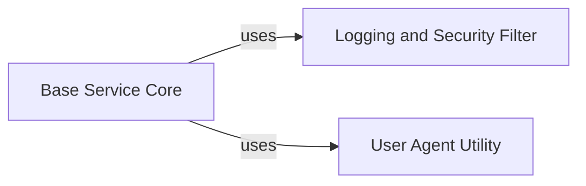

## Component Details

This section details the 'Logging and Request Helpers' subsystem, which is broken down into two distinct components: 'Logging and Security Filter' and 'User Agent Utility'. The 'Logging and Security Filter' is crucial for maintaining data privacy by redacting sensitive information from logs, while the 'User Agent Utility' is responsible for generating comprehensive user agent strings for HTTP requests, aiding in request identification and debugging. Both components are utilized by the 'Base Service Core' to ensure secure and informative SDK operations.

### Logging and Security Filter
This component is responsible for filtering and redacting sensitive information (like API keys and tokens) from log messages before they are output. It ensures secure logging practices by preventing confidential data exposure.

**Related Classes/Methods**:

- <a href="https://github.com/IBM/python-sdk-core/blob/master/ibm_cloud_sdk_core/logger.py#L48-L80" target="_blank" rel="noopener noreferrer">`ibm_cloud_sdk_core.logger.LoggingFilter` (48:80)</a>
- <a href="https://github.com/IBM/python-sdk-core/blob/master/ibm_cloud_sdk_core/logger.py#L73-L80" target="_blank" rel="noopener noreferrer">`ibm_cloud_sdk_core.logger.LoggingFilter:filter_message` (73:80)</a>
- <a href="https://github.com/IBM/python-sdk-core/blob/master/ibm_cloud_sdk_core/logger.py#L57-L70" target="_blank" rel="noopener noreferrer">`ibm_cloud_sdk_core.logger.LoggingFilter.redact_secrets` (57:70)</a>

### User Agent Utility
This component is a helper module dedicated to constructing the User-Agent string for HTTP requests. It gathers system information and combines it with SDK details (including version information) to create a comprehensive user agent, aiding in request identification and debugging.

**Related Classes/Methods**:

- <a href="https://github.com/IBM/python-sdk-core/blob/master/ibm_cloud_sdk_core/private_helpers.py#L1-L50" target="_blank" rel="noopener noreferrer">`ibm_cloud_sdk_core.private_helpers` (1:50)</a>
- <a href="https://github.com/IBM/python-sdk-core/blob/master/ibm_cloud_sdk_core/private_helpers.py#L30-L34" target="_blank" rel="noopener noreferrer">`ibm_cloud_sdk_core.private_helpers._build_user_agent` (30:34)</a>
- <a href="https://github.com/IBM/python-sdk-core/blob/master/ibm_cloud_sdk_core/private_helpers.py#L24-L27" target="_blank" rel="noopener noreferrer">`ibm_cloud_sdk_core.private_helpers._get_system_info` (24:27)</a>
- `ibm_cloud_sdk_core.version` (full file reference)

### Base Service Core
This component provides the foundational functionalities for all IBM Cloud SDK services. It handles HTTP request preparation, sending, response processing, SSL verification, and retry mechanisms. It integrates with authentication mechanisms, logging, and user agent string generation. It's the central hub for service-level operations.

**Related Classes/Methods**:

- <a href="https://github.com/IBM/python-sdk-core/blob/master/ibm_cloud_sdk_core/base_service.py#L56-L511" target="_blank" rel="noopener noreferrer">`ibm_cloud_sdk_core.base_service.BaseService` (56:511)</a>
- <a href="https://github.com/IBM/python-sdk-core/blob/master/ibm_cloud_sdk_core/base_service.py#L91-L122" target="_blank" rel="noopener noreferrer">`ibm_cloud_sdk_core.base_service.BaseService:__init__` (91:122)</a>
- <a href="https://github.com/IBM/python-sdk-core/blob/master/ibm_cloud_sdk_core/http_adapter.py#L8-L28" target="_blank" rel="noopener noreferrer">`ibm_cloud_sdk_core.http_adapter.SSLHTTPAdapter` (8:28)</a>

### [FAQ](https://github.com/CodeBoarding/GeneratedOnBoardings/tree/main?tab=readme-ov-file#faq)