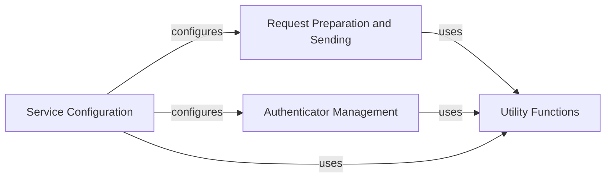

## Component Details

This graph illustrates the core components of the SDK, focusing on how service configuration, request handling, and authenticator management are interconnected. The `Service Configuration` component initializes the SDK by reading external settings. This configuration then influences both `Request Preparation and Sending` for constructing HTTP requests and `Authenticator Management` for handling authentication. The `Utility Functions` component provides general-purpose helpers that are utilized by all other core components for various tasks like data manipulation and type conversions, ensuring a streamlined and efficient operation of the SDK.

### Service Configuration
This component is responsible for configuring the base service and authenticators by reading external sources such as credential files, environment variables, and VCAP services. It handles the initial setup of service URLs, SSL verification, and gzip compression based on these configurations.

**Related Classes/Methods**:

- <a href="https://github.com/IBM/python-sdk-core/blob/master/ibm_cloud_sdk_core/base_service.py#L160-L193" target="_blank" rel="noopener noreferrer">`ibm_cloud_sdk_core.base_service.BaseService:configure_service` (160:193)</a>
- <a href="https://github.com/IBM/python-sdk-core/blob/master/ibm_cloud_sdk_core/get_authenticator.py#L37-L58" target="_blank" rel="noopener noreferrer">`ibm_cloud_sdk_core.get_authenticator:get_authenticator_from_environment` (37:58)</a>
- <a href="https://github.com/IBM/python-sdk-core/blob/master/ibm_cloud_sdk_core/utils.py#L347-L372" target="_blank" rel="noopener noreferrer">`ibm_cloud_sdk_core.utils:read_external_sources` (347:372)</a>
- <a href="https://github.com/IBM/python-sdk-core/blob/master/ibm_cloud_sdk_core/utils.py#L390-L433" target="_blank" rel="noopener noreferrer">`ibm_cloud_sdk_core.utils.__read_from_credential_file` (390:433)</a>
- <a href="https://github.com/IBM/python-sdk-core/blob/master/ibm_cloud_sdk_core/utils.py#L375-L387" target="_blank" rel="noopener noreferrer">`ibm_cloud_sdk_core.utils.__read_from_env_variables` (375:387)</a>
- <a href="https://github.com/IBM/python-sdk-core/blob/master/ibm_cloud_sdk_core/utils.py#L442-L483" target="_blank" rel="noopener noreferrer">`ibm_cloud_sdk_core.utils.__read_from_vcap_services` (442:483)</a>
- <a href="https://github.com/IBM/python-sdk-core/blob/master/ibm_cloud_sdk_core/utils.py#L436-L439" target="_blank" rel="noopener noreferrer">`ibm_cloud_sdk_core.utils._parse_key_and_update_config` (436:439)</a>

### Request Preparation and Sending
This component handles the preparation of HTTP requests, including setting headers, parameters, and data, and then sending these requests. It also manages SSL verification, gzip compression, and processes the responses, converting them into `DetailedResponse` objects or raising `ApiException` for errors.

**Related Classes/Methods**:

- <a href="https://github.com/IBM/python-sdk-core/blob/master/ibm_cloud_sdk_core/base_service.py#L298-L365" target="_blank" rel="noopener noreferrer">`ibm_cloud_sdk_core.base_service.BaseService:send` (298:365)</a>
- <a href="https://github.com/IBM/python-sdk-core/blob/master/ibm_cloud_sdk_core/base_service.py#L375-L476" target="_blank" rel="noopener noreferrer">`ibm_cloud_sdk_core.base_service.BaseService:prepare_request` (375:476)</a>
- <a href="https://github.com/IBM/python-sdk-core/blob/master/ibm_cloud_sdk_core/base_service.py#L241-L258" target="_blank" rel="noopener noreferrer">`ibm_cloud_sdk_core.base_service.BaseService:set_service_url` (241:258)</a>
- <a href="https://github.com/IBM/python-sdk-core/blob/master/ibm_cloud_sdk_core/utils.py#L168-L172" target="_blank" rel="noopener noreferrer">`ibm_cloud_sdk_core.utils:strip_extra_slashes` (168:172)</a>
- <a href="https://github.com/IBM/python-sdk-core/blob/master/ibm_cloud_sdk_core/utils.py#L130-L141" target="_blank" rel="noopener noreferrer">`ibm_cloud_sdk_core.utils:remove_null_values` (130:141)</a>
- <a href="https://github.com/IBM/python-sdk-core/blob/master/ibm_cloud_sdk_core/utils.py#L144-L158" target="_blank" rel="noopener noreferrer">`ibm_cloud_sdk_core.utils:cleanup_values` (144:158)</a>
- <a href="https://github.com/IBM/python-sdk-core/blob/master/ibm_cloud_sdk_core/utils.py#L161-L165" target="_blank" rel="noopener noreferrer">`ibm_cloud_sdk_core.utils:cleanup_value` (161:165)</a>
- <a href="https://github.com/IBM/python-sdk-core/blob/master/ibm_cloud_sdk_core/utils.py#L33-L115" target="_blank" rel="noopener noreferrer">`ibm_cloud_sdk_core.utils:GzipStream` (33:115)</a>
- <a href="https://github.com/IBM/python-sdk-core/blob/master/ibm_cloud_sdk_core/utils.py#L490-L499" target="_blank" rel="noopener noreferrer">`ibm_cloud_sdk_core.utils:is_json_mimetype` (490:499)</a>

### Authenticator Management
This component is responsible for constructing and validating different types of authenticators based on the provided configuration. It ensures that the correct authenticator is used for API requests and performs necessary validations.

**Related Classes/Methods**:

- <a href="https://github.com/IBM/python-sdk-core/blob/master/ibm_cloud_sdk_core/get_authenticator.py#L63-L181" target="_blank" rel="noopener noreferrer">`ibm_cloud_sdk_core.get_authenticator:__construct_authenticator` (63:181)</a>
- <a href="https://github.com/IBM/python-sdk-core/blob/master/ibm_cloud_sdk_core/utils.py#L276-L285" target="_blank" rel="noopener noreferrer">`ibm_cloud_sdk_core.utils:string_to_bool` (276:285)</a>
- <a href="https://github.com/IBM/python-sdk-core/blob/master/ibm_cloud_sdk_core/authenticators/basic_authenticator.py#L54-L69" target="_blank" rel="noopener noreferrer">`ibm_cloud_sdk_core.authenticators.basic_authenticator.BasicAuthenticator:validate` (54:69)</a>
- <a href="https://github.com/IBM/python-sdk-core/blob/master/ibm_cloud_sdk_core/authenticators/cp4d_authenticator.py#L90-L122" target="_blank" rel="noopener noreferrer">`ibm_cloud_sdk_core.authenticators.cp4d_authenticator.CloudPakForDataAuthenticator:validate` (90:122)</a>
- <a href="https://github.com/IBM/python-sdk-core/blob/master/ibm_cloud_sdk_core/authenticators/iam_authenticator.py#L92-L110" target="_blank" rel="noopener noreferrer">`ibm_cloud_sdk_core.authenticators.iam_authenticator.IAMAuthenticator:validate` (92:110)</a>
- <a href="https://github.com/IBM/python-sdk-core/blob/master/ibm_cloud_sdk_core/utils.py#L118-L127" target="_blank" rel="noopener noreferrer">`ibm_cloud_sdk_core.utils:has_bad_first_or_last_char` (118:127)</a>

### Utility Functions
This component provides a collection of general utility functions used across the SDK, including string and datetime conversions, value cleaning, and URL manipulation. These functions support various operations within the service and authenticator components.

**Related Classes/Methods**:

- <a href="https://github.com/IBM/python-sdk-core/blob/master/ibm_cloud_sdk_core/utils.py#L210-L226" target="_blank" rel="noopener noreferrer">`ibm_cloud_sdk_core.utils:string_to_datetime_list` (210:226)</a>
- <a href="https://github.com/IBM/python-sdk-core/blob/master/ibm_cloud_sdk_core/utils.py#L195-L207" target="_blank" rel="noopener noreferrer">`ibm_cloud_sdk_core.utils:string_to_datetime` (195:207)</a>
- <a href="https://github.com/IBM/python-sdk-core/blob/master/ibm_cloud_sdk_core/utils.py#L229-L247" target="_blank" rel="noopener noreferrer">`ibm_cloud_sdk_core.utils:datetime_to_string_list` (229:247)</a>
- <a href="https://github.com/IBM/python-sdk-core/blob/master/ibm_cloud_sdk_core/utils.py#L175-L192" target="_blank" rel="noopener noreferrer">`ibm_cloud_sdk_core.utils:datetime_to_string` (175:192)</a>

### [FAQ](https://github.com/CodeBoarding/GeneratedOnBoardings/tree/main?tab=readme-ov-file#faq)