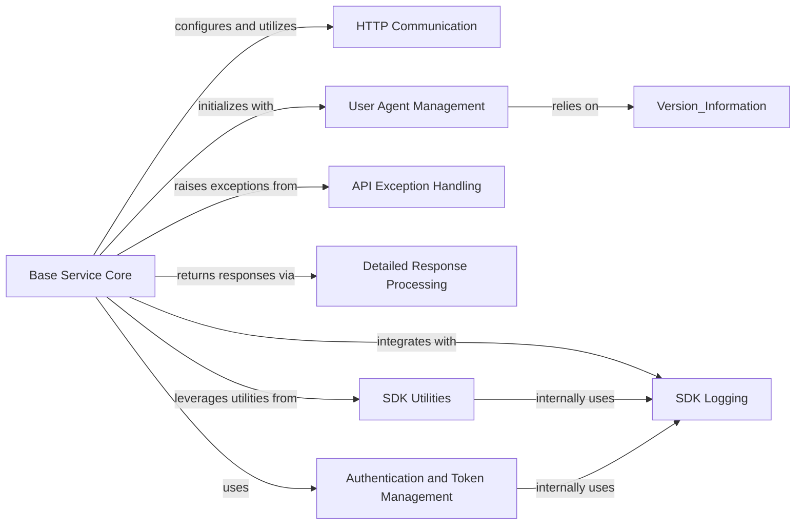

## Component Details

The `Service Core` subsystem in the IBM Cloud SDK is designed to provide the foundational logic for interacting with IBM Cloud services. Its primary purpose is to manage the lifecycle of HTTP requests, from preparation and authentication to sending and processing responses, including error handling and retries. It integrates various components such as authentication mechanisms, HTTP communication adapters, utility functions for configuration and data manipulation, and logging capabilities to ensure robust and secure interactions with cloud services.

### Base Service Core
Encapsulates fundamental logic for an IBM Cloud SDK service, handling initialization, URL configuration, SSL verification, gzip compression, and the core processes of preparing and sending HTTP requests, including retries. It orchestrates interactions with authentication, HTTP communication, and utility components.

**Related Classes/Methods**:

- <a href="https://github.com/IBM/python-sdk-core/blob/master/ibm_cloud_sdk_core/base_service.py#L56-L511" target="_blank" rel="noopener noreferrer">`ibm_cloud_sdk_core.base_service.BaseService` (56:511)</a>
- <a href="https://github.com/IBM/python-sdk-core/blob/master/ibm_cloud_sdk_core/base_service.py#L91-L122" target="_blank" rel="noopener noreferrer">`ibm_cloud_sdk_core.base_service.BaseService:__init__` (91:122)</a>
- <a href="https://github.com/IBM/python-sdk-core/blob/master/ibm_cloud_sdk_core/base_service.py#L298-L365" target="_blank" rel="noopener noreferrer">`ibm_cloud_sdk_core.base_service.BaseService.send` (298:365)</a>
- <a href="https://github.com/IBM/python-sdk-core/blob/master/ibm_cloud_sdk_core/base_service.py#L375-L476" target="_blank" rel="noopener noreferrer">`ibm_cloud_sdk_core.base_service.BaseService.prepare_request` (375:476)</a>
- <a href="https://github.com/IBM/python-sdk-core/blob/master/ibm_cloud_sdk_core/base_service.py#L241-L258" target="_blank" rel="noopener noreferrer">`ibm_cloud_sdk_core.base_service.BaseService.set_service_url` (241:258)</a>
- <a href="https://github.com/IBM/python-sdk-core/blob/master/ibm_cloud_sdk_core/base_service.py#L195-L197" target="_blank" rel="noopener noreferrer">`ibm_cloud_sdk_core.base_service.BaseService._set_user_agent_header` (195:197)</a>
- <a href="https://github.com/IBM/python-sdk-core/blob/master/ibm_cloud_sdk_core/base_service.py#L124-L150" target="_blank" rel="noopener noreferrer">`ibm_cloud_sdk_core.base_service.BaseService:enable_retries` (124:150)</a>
- <a href="https://github.com/IBM/python-sdk-core/blob/master/ibm_cloud_sdk_core/base_service.py#L152-L158" target="_blank" rel="noopener noreferrer">`ibm_cloud_sdk_core.base_service.BaseService:disable_retries` (152:158)</a>
- <a href="https://github.com/IBM/python-sdk-core/blob/master/ibm_cloud_sdk_core/base_service.py#L160-L193" target="_blank" rel="noopener noreferrer">`ibm_cloud_sdk_core.base_service.BaseService:configure_service` (160:193)</a>
- <a href="https://github.com/IBM/python-sdk-core/blob/master/ibm_cloud_sdk_core/base_service.py#L221-L239" target="_blank" rel="noopener noreferrer">`ibm_cloud_sdk_core.base_service.BaseService.set_disable_ssl_verification` (221:239)</a>
- <a href="https://github.com/IBM/python-sdk-core/blob/master/ibm_cloud_sdk_core/base_service.py#L367-L369" target="_blank" rel="noopener noreferrer">`ibm_cloud_sdk_core.base_service.BaseService.set_enable_gzip_compression` (367:369)</a>
- <a href="https://github.com/IBM/python-sdk-core/blob/master/ibm_cloud_sdk_core/base_service.py#L371-L373" target="_blank" rel="noopener noreferrer">`ibm_cloud_sdk_core.base_service.BaseService.get_enable_gzip_compression` (371:373)</a>
- <a href="https://github.com/IBM/python-sdk-core/blob/master/ibm_cloud_sdk_core/base_service.py#L510-L511" target="_blank" rel="noopener noreferrer">`ibm_cloud_sdk_core.base_service.BaseService._encode_path_vars` (510:511)</a>
- <a href="https://github.com/IBM/python-sdk-core/blob/master/ibm_cloud_sdk_core/base_service.py#L479-L488" target="_blank" rel="noopener noreferrer">`ibm_cloud_sdk_core.base_service.BaseService.encode_path_vars` (479:488)</a>

### HTTP Communication
This component is responsible for handling the underlying HTTP communication, including SSL verification and retry mechanisms for network requests. It provides the low-level HTTP client functionality.

**Related Classes/Methods**:

- <a href="https://github.com/IBM/python-sdk-core/blob/master/ibm_cloud_sdk_core/http_adapter.py#L8-L28" target="_blank" rel="noopener noreferrer">`ibm_cloud_sdk_core.http_adapter.SSLHTTPAdapter` (8:28)</a>

### SDK Utilities
This component provides a collection of utility functions used across the SDK for various tasks such as reading external configuration sources (credential files, environment variables, VCAP services), string manipulation (stripping slashes, checking characters), data cleaning (removing null values, general cleanup), and handling Gzip streams. It also interacts with the SDK Logging component.

**Related Classes/Methods**:

- <a href="https://github.com/IBM/python-sdk-core/blob/master/ibm_cloud_sdk_core/utils.py#L347-L372" target="_blank" rel="noopener noreferrer">`ibm_cloud_sdk_core.utils.read_external_sources` (347:372)</a>
- <a href="https://github.com/IBM/python-sdk-core/blob/master/ibm_cloud_sdk_core/utils.py#L118-L127" target="_blank" rel="noopener noreferrer">`ibm_cloud_sdk_core.utils.has_bad_first_or_last_char` (118:127)</a>
- <a href="https://github.com/IBM/python-sdk-core/blob/master/ibm_cloud_sdk_core/utils.py#L490-L499" target="_blank" rel="noopener noreferrer">`ibm_cloud_sdk_core.utils.is_json_mimetype` (490:499)</a>
- <a href="https://github.com/IBM/python-sdk-core/blob/master/ibm_cloud_sdk_core/utils.py#L168-L172" target="_blank" rel="noopener noreferrer">`ibm_cloud_sdk_core.utils.strip_extra_slashes` (168:172)</a>
- <a href="https://github.com/IBM/python-sdk-core/blob/master/ibm_cloud_sdk_core/utils.py#L130-L141" target="_blank" rel="noopener noreferrer">`ibm_cloud_sdk_core.utils.remove_null_values` (130:141)</a>
- <a href="https://github.com/IBM/python-sdk-core/blob/master/ibm_cloud_sdk_core/utils.py#L144-L158" target="_blank" rel="noopener noreferrer">`ibm_cloud_sdk_core.utils.cleanup_values` (144:158)</a>
- <a href="https://github.com/IBM/python-sdk-core/blob/master/ibm_cloud_sdk_core/utils.py#L33-L115" target="_blank" rel="noopener noreferrer">`ibm_cloud_sdk_core.utils.GzipStream` (33:115)</a>
- <a href="https://github.com/IBM/python-sdk-core/blob/master/ibm_cloud_sdk_core/utils.py#L161-L165" target="_blank" rel="noopener noreferrer">`ibm_cloud_sdk_core.utils.cleanup_value` (161:165)</a>
- <a href="https://github.com/IBM/python-sdk-core/blob/master/ibm_cloud_sdk_core/utils.py#L390-L433" target="_blank" rel="noopener noreferrer">`ibm_cloud_sdk_core.utils.__read_from_credential_file` (390:433)</a>
- <a href="https://github.com/IBM/python-sdk-core/blob/master/ibm_cloud_sdk_core/utils.py#L375-L387" target="_blank" rel="noopener noreferrer">`ibm_cloud_sdk_core.utils.__read_from_env_variables` (375:387)</a>
- <a href="https://github.com/IBM/python-sdk-core/blob/master/ibm_cloud_sdk_core/utils.py#L442-L483" target="_blank" rel="noopener noreferrer">`ibm_cloud_sdk_core.utils.__read_from_vcap_services` (442:483)</a>
- <a href="https://github.com/IBM/python-sdk-core/blob/master/ibm_cloud_sdk_core/utils.py#L436-L439" target="_blank" rel="noopener noreferrer">`ibm_cloud_sdk_core.utils._parse_key_and_update_config` (436:439)</a>

### API Exception Handling
This component defines and manages exceptions specific to API interactions, providing structured error messages and response details when API calls fail.

**Related Classes/Methods**:

- <a href="https://github.com/IBM/python-sdk-core/blob/master/ibm_cloud_sdk_core/api_exception.py#L24-L90" target="_blank" rel="noopener noreferrer">`ibm_cloud_sdk_core.api_exception.ApiException` (24:90)</a>
- <a href="https://github.com/IBM/python-sdk-core/blob/master/ibm_cloud_sdk_core/api_exception.py#L39-L48" target="_blank" rel="noopener noreferrer">`ibm_cloud_sdk_core.api_exception.ApiException:__init__` (39:48)</a>
- <a href="https://github.com/IBM/python-sdk-core/blob/master/ibm_cloud_sdk_core/api_exception.py#L70-L90" target="_blank" rel="noopener noreferrer">`ibm_cloud_sdk_core.api_exception.ApiException._get_error_message` (70:90)</a>

### Detailed Response Processing
This component is responsible for encapsulating and providing access to the full details of an API response, including the result, status code, and headers, and facilitating their conversion to a dictionary representation.

**Related Classes/Methods**:

- <a href="https://github.com/IBM/python-sdk-core/blob/master/ibm_cloud_sdk_core/detailed_response.py#L23-L87" target="_blank" rel="noopener noreferrer">`ibm_cloud_sdk_core.detailed_response.DetailedResponse` (23:87)</a>
- <a href="https://github.com/IBM/python-sdk-core/blob/master/ibm_cloud_sdk_core/detailed_response.py#L86-L87" target="_blank" rel="noopener noreferrer">`ibm_cloud_sdk_core.detailed_response.DetailedResponse:__str__` (86:87)</a>
- <a href="https://github.com/IBM/python-sdk-core/blob/master/ibm_cloud_sdk_core/detailed_response.py#L76-L84" target="_blank" rel="noopener noreferrer">`ibm_cloud_sdk_core.detailed_response.DetailedResponse._to_dict` (76:84)</a>

### SDK Logging
This component provides logging capabilities for the SDK, including the ability to filter and redact sensitive information from log messages to ensure security and privacy.

**Related Classes/Methods**:

- <a href="https://github.com/IBM/python-sdk-core/blob/master/ibm_cloud_sdk_core/logger.py#L48-L80" target="_blank" rel="noopener noreferrer">`ibm_cloud_sdk_core.logger.LoggingFilter` (48:80)</a>
- <a href="https://github.com/IBM/python-sdk-core/blob/master/ibm_cloud_sdk_core/logger.py#L73-L80" target="_blank" rel="noopener noreferrer">`ibm_cloud_sdk_core.logger.LoggingFilter.filter_message` (73:80)</a>
- <a href="https://github.com/IBM/python-sdk-core/blob/master/ibm_cloud_sdk_core/logger.py#L57-L70" target="_blank" rel="noopener noreferrer">`ibm_cloud_sdk_core.logger.LoggingFilter.redact_secrets` (57:70)</a>

### User Agent Management
This component is responsible for constructing and managing the user-agent string for outgoing requests, incorporating system information to identify the SDK and environment. It relies on version information.

**Related Classes/Methods**:

- <a href="https://github.com/IBM/python-sdk-core/blob/master/ibm_cloud_sdk_core/private_helpers.py#L30-L34" target="_blank" rel="noopener noreferrer">`ibm_cloud_sdk_core.private_helpers._build_user_agent` (30:34)</a>
- <a href="https://github.com/IBM/python-sdk-core/blob/master/ibm_cloud_sdk_core/private_helpers.py#L24-L27" target="_blank" rel="noopener noreferrer">`ibm_cloud_sdk_core.private_helpers._get_system_info` (24:27)</a>
- `ibm_cloud_sdk_core.version` (full file reference)

### Authentication and Token Management
This component handles various authentication mechanisms and manages the lifecycle of access tokens required for interacting with IBM Cloud services. It includes different types of authenticators and their corresponding token managers.

**Related Classes/Methods**:

- <a href="https://github.com/IBM/python-sdk-core/blob/master/ibm_cloud_sdk_core/authenticators/authenticator.py#L20-L60" target="_blank" rel="noopener noreferrer">`ibm_cloud_sdk_core.authenticators.authenticator.Authenticator` (20:60)</a>
- <a href="https://github.com/IBM/python-sdk-core/blob/master/ibm_cloud_sdk_core/authenticators/basic_authenticator.py#L28-L89" target="_blank" rel="noopener noreferrer">`ibm_cloud_sdk_core.authenticators.basic_authenticator.BasicAuthenticator` (28:89)</a>
- <a href="https://github.com/IBM/python-sdk-core/blob/master/ibm_cloud_sdk_core/authenticators/bearer_token_authenticator.py#L25-L85" target="_blank" rel="noopener noreferrer">`ibm_cloud_sdk_core.authenticators.bearer_token_authenticator.BearerTokenAuthenticator` (25:85)</a>
- <a href="https://github.com/IBM/python-sdk-core/blob/master/ibm_cloud_sdk_core/authenticators/container_authenticator.py#L24-L151" target="_blank" rel="noopener noreferrer">`ibm_cloud_sdk_core.authenticators.container_authenticator.ContainerAuthenticator` (24:151)</a>
- <a href="https://github.com/IBM/python-sdk-core/blob/master/ibm_cloud_sdk_core/authenticators/cp4d_authenticator.py#L28-L168" target="_blank" rel="noopener noreferrer">`ibm_cloud_sdk_core.authenticators.cp4d_authenticator.CloudPakForDataAuthenticator` (28:168)</a>
- <a href="https://github.com/IBM/python-sdk-core/blob/master/ibm_cloud_sdk_core/authenticators/iam_assume_authenticator.py#L26-L146" target="_blank" rel="noopener noreferrer">`ibm_cloud_sdk_core.authenticators.iam_assume_authenticator.IAMAssumeAuthenticator` (26:146)</a>
- <a href="https://github.com/IBM/python-sdk-core/blob/master/ibm_cloud_sdk_core/authenticators/iam_authenticator.py#L25-L110" target="_blank" rel="noopener noreferrer">`ibm_cloud_sdk_core.authenticators.iam_authenticator.IAMAuthenticator` (25:110)</a>
- <a href="https://github.com/IBM/python-sdk-core/blob/master/ibm_cloud_sdk_core/authenticators/iam_request_based_authenticator.py#L27-L118" target="_blank" rel="noopener noreferrer">`ibm_cloud_sdk_core.authenticators.iam_request_based_authenticator.IAMRequestBasedAuthenticator` (27:118)</a>
- <a href="https://github.com/IBM/python-sdk-core/blob/master/ibm_cloud_sdk_core/authenticators/mcsp_authenticator.py#L28-L134" target="_blank" rel="noopener noreferrer">`ibm_cloud_sdk_core.authenticators.mcsp_authenticator.MCSPAuthenticator` (28:134)</a>
- <a href="https://github.com/IBM/python-sdk-core/blob/master/ibm_cloud_sdk_core/authenticators/mcspv2_authenticator.py#L28-L270" target="_blank" rel="noopener noreferrer">`ibm_cloud_sdk_core.authenticators.mcspv2_authenticator.MCSPV2Authenticator` (28:270)</a>
- <a href="https://github.com/IBM/python-sdk-core/blob/master/ibm_cloud_sdk_core/authenticators/no_auth_authenticator.py#L20-L31" target="_blank" rel="noopener noreferrer">`ibm_cloud_sdk_core.authenticators.no_auth_authenticator.NoAuthAuthenticator` (20:31)</a>
- <a href="https://github.com/IBM/python-sdk-core/blob/master/ibm_cloud_sdk_core/authenticators/vpc_instance_authenticator.py#L28-L125" target="_blank" rel="noopener noreferrer">`ibm_cloud_sdk_core.authenticators.vpc_instance_authenticator.VPCInstanceAuthenticator` (28:125)</a>
- <a href="https://github.com/IBM/python-sdk-core/blob/master/ibm_cloud_sdk_core/token_managers/token_manager.py#L31-L216" target="_blank" rel="noopener noreferrer">`ibm_cloud_sdk_core.token_managers.token_manager.TokenManager` (31:216)</a>
- <a href="https://github.com/IBM/python-sdk-core/blob/master/ibm_cloud_sdk_core/token_managers/container_token_manager.py#L26-L206" target="_blank" rel="noopener noreferrer">`ibm_cloud_sdk_core.token_managers.container_token_manager.ContainerTokenManager` (26:206)</a>
- <a href="https://github.com/IBM/python-sdk-core/blob/master/ibm_cloud_sdk_core/token_managers/cp4d_token_manager.py#L27-L129" target="_blank" rel="noopener noreferrer">`ibm_cloud_sdk_core.token_managers.cp4d_token_manager.CP4DTokenManager` (27:129)</a>
- <a href="https://github.com/IBM/python-sdk-core/blob/master/ibm_cloud_sdk_core/token_managers/iam_assume_token_manager.py#L26-L150" target="_blank" rel="noopener noreferrer">`ibm_cloud_sdk_core.token_managers.iam_assume_token_manager.IAMAssumeTokenManager` (26:150)</a>
- <a href="https://github.com/IBM/python-sdk-core/blob/master/ibm_cloud_sdk_core/token_managers/iam_request_based_token_manager.py#L26-L199" target="_blank" rel="noopener noreferrer">`ibm_cloud_sdk_core.token_managers.iam_request_based_token_manager.IAMRequestBasedTokenManager` (26:199)</a>
- <a href="https://github.com/IBM/python-sdk-core/blob/master/ibm_cloud_sdk_core/token_managers/iam_token_manager.py#L23-L93" target="_blank" rel="noopener noreferrer">`ibm_cloud_sdk_core.token_managers.iam_token_manager.IAMTokenManager` (23:93)</a>
- <a href="https://github.com/IBM/python-sdk-core/blob/master/ibm_cloud_sdk_core/token_managers/jwt_token_manager.py#L27-L91" target="_blank" rel="noopener noreferrer">`ibm_cloud_sdk_core.token_managers.jwt_token_manager.JWTTokenManager` (27:91)</a>
- <a href="https://github.com/IBM/python-sdk-core/blob/master/ibm_cloud_sdk_core/token_managers/mcsp_token_manager.py#L27-L108" target="_blank" rel="noopener noreferrer">`ibm_cloud_sdk_core.token_managers.mcsp_token_manager.MCSPTokenManager` (27:108)</a>
- <a href="https://github.com/IBM/python-sdk-core/blob/master/ibm_cloud_sdk_core/token_managers/mcspv2_token_manager.py#L28-L185" target="_blank" rel="noopener noreferrer">`ibm_cloud_sdk_core.token_managers.mcspv2_token_manager.MCSPV2TokenManager` (28:185)</a>
- <a href="https://github.com/IBM/python-sdk-core/blob/master/ibm_cloud_sdk_core/token_managers/vpc_instance_token_manager.py#L27-L174" target="_blank" rel="noopener noreferrer">`ibm_cloud_sdk_core.token_managers.vpc_instance_token_manager.VPCInstanceTokenManager` (27:174)</a>
- `ibm_cloud_sdk_core.get_authenticator` (full file reference)

### [FAQ](https://github.com/CodeBoarding/GeneratedOnBoardings/tree/main?tab=readme-ov-file#faq)