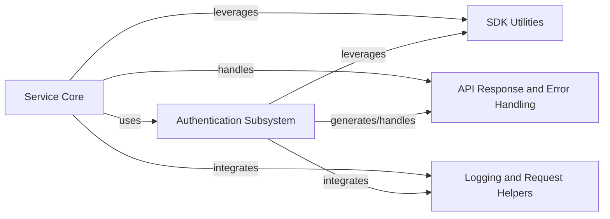

## Component Details

The `python-sdk-core` project provides the foundational framework for IBM Cloud SDKs, enabling seamless interaction with IBM Cloud services. Its core functionality revolves around a `Service Core` that handles HTTP request lifecycle, supported by a robust `Authentication Subsystem` that manages various authentication schemes and token lifecycles. The SDK also incorporates `API Response and Error Handling` for structured feedback, `SDK Utilities` for common helper tasks, and `Logging and Request Helpers` for internal diagnostics and request metadata.

### Service Core
Encapsulates fundamental logic for an IBM Cloud SDK service, handling initialization, URL configuration, SSL verification, gzip compression, and the core processes of preparing and sending HTTP requests, including retries.

**Related Classes/Methods**:

- <a href="https://github.com/IBM/python-sdk-core/blob/master/ibm_cloud_sdk_core/base_service.py#L56-L511" target="_blank" rel="noopener noreferrer">`python-sdk-core.ibm_cloud_sdk_core.base_service.BaseService` (56:511)</a>
- <a href="https://github.com/IBM/python-sdk-core/blob/master/ibm_cloud_sdk_core/base_service.py#L91-L122" target="_blank" rel="noopener noreferrer">`python-sdk-core.ibm_cloud_sdk_core.base_service.BaseService:__init__` (91:122)</a>
- <a href="https://github.com/IBM/python-sdk-core/blob/master/ibm_cloud_sdk_core/base_service.py#L298-L365" target="_blank" rel="noopener noreferrer">`python-sdk-core.ibm_cloud_sdk_core.base_service.BaseService.send` (298:365)</a>
- <a href="https://github.com/IBM/python-sdk-core/blob/master/ibm_cloud_sdk_core/base_service.py#L375-L476" target="_blank" rel="noopener noreferrer">`python-sdk-core.ibm_cloud_sdk_core.base_service.BaseService.prepare_request` (375:476)</a>
- <a href="https://github.com/IBM/python-sdk-core/blob/master/ibm_cloud_sdk_core/http_adapter.py#L8-L28" target="_blank" rel="noopener noreferrer">`python-sdk-core.ibm_cloud_sdk_core.http_adapter.SSLHTTPAdapter` (8:28)</a>

### Authentication Subsystem
Manages all aspects of authentication within the SDK, including the creation and retrieval of various authenticator types, defining core authentication interfaces, providing concrete authenticator implementations for different schemes, and handling the lifecycle of authentication tokens.

**Related Classes/Methods**:

- <a href="https://github.com/IBM/python-sdk-core/blob/master/ibm_cloud_sdk_core/get_authenticator.py#L1-L140" target="_blank" rel="noopener noreferrer">`python-sdk-core.ibm_cloud_sdk_core.get_authenticator` (1:140)</a>
- <a href="https://github.com/IBM/python-sdk-core/blob/master/ibm_cloud_sdk_core/get_authenticator.py#L37-L58" target="_blank" rel="noopener noreferrer">`python-sdk-core.ibm_cloud_sdk_core.get_authenticator:get_authenticator_from_environment` (37:58)</a>
- <a href="https://github.com/IBM/python-sdk-core/blob/master/ibm_cloud_sdk_core/get_authenticator.py#L63-L181" target="_blank" rel="noopener noreferrer">`python-sdk-core.ibm_cloud_sdk_core.get_authenticator.__construct_authenticator` (63:181)</a>
- <a href="https://github.com/IBM/python-sdk-core/blob/master/ibm_cloud_sdk_core/authenticators/authenticator.py#L20-L60" target="_blank" rel="noopener noreferrer">`python-sdk-core.ibm_cloud_sdk_core.authenticators.authenticator.Authenticator` (20:60)</a>
- <a href="https://github.com/IBM/python-sdk-core/blob/master/ibm_cloud_sdk_core/authenticators/iam_request_based_authenticator.py#L27-L118" target="_blank" rel="noopener noreferrer">`python-sdk-core.ibm_cloud_sdk_core.authenticators.iam_request_based_authenticator.IAMRequestBasedAuthenticator` (27:118)</a>
- <a href="https://github.com/IBM/python-sdk-core/blob/master/ibm_cloud_sdk_core/token_managers/token_manager.py#L31-L216" target="_blank" rel="noopener noreferrer">`python-sdk-core.ibm_cloud_sdk_core.token_managers.token_manager.TokenManager` (31:216)</a>
- <a href="https://github.com/IBM/python-sdk-core/blob/master/ibm_cloud_sdk_core/token_managers/jwt_token_manager.py#L27-L91" target="_blank" rel="noopener noreferrer">`python-sdk-core.ibm_cloud_sdk_core.token_managers.jwt_token_manager.JWTTokenManager` (27:91)</a>
- <a href="https://github.com/IBM/python-sdk-core/blob/master/ibm_cloud_sdk_core/token_managers/iam_request_based_token_manager.py#L26-L199" target="_blank" rel="noopener noreferrer">`python-sdk-core.ibm_cloud_sdk_core.token_managers.iam_request_based_token_manager.IAMRequestBasedTokenManager` (26:199)</a>
- <a href="https://github.com/IBM/python-sdk-core/blob/master/ibm_cloud_sdk_core/authenticators/basic_authenticator.py#L28-L89" target="_blank" rel="noopener noreferrer">`python-sdk-core.ibm_cloud_sdk_core.authenticators.basic_authenticator.BasicAuthenticator` (28:89)</a>
- <a href="https://github.com/IBM/python-sdk-core/blob/master/ibm_cloud_sdk_core/authenticators/bearer_token_authenticator.py#L25-L85" target="_blank" rel="noopener noreferrer">`python-sdk-core.ibm_cloud_sdk_core.authenticators.bearer_token_authenticator.BearerTokenAuthenticator` (25:85)</a>
- <a href="https://github.com/IBM/python-sdk-core/blob/master/ibm_cloud_sdk_core/authenticators/container_authenticator.py#L24-L151" target="_blank" rel="noopener noreferrer">`python-sdk-core.ibm_cloud_sdk_core.authenticators.container_authenticator.ContainerAuthenticator` (24:151)</a>
- <a href="https://github.com/IBM/python-sdk-core/blob/master/ibm_cloud_sdk_core/authenticators/cp4d_authenticator.py#L28-L168" target="_blank" rel="noopener noreferrer">`python-sdk-core.ibm_cloud_sdk_core.authenticators.cp4d_authenticator.CloudPakForDataAuthenticator` (28:168)</a>
- <a href="https://github.com/IBM/python-sdk-core/blob/master/ibm_cloud_sdk_core/authenticators/iam_authenticator.py#L25-L110" target="_blank" rel="noopener noreferrer">`python-sdk-core.ibm_cloud_sdk_core.authenticators.iam_authenticator.IAMAuthenticator` (25:110)</a>
- <a href="https://github.com/IBM/python-sdk-core/blob/master/ibm_cloud_sdk_core/authenticators/iam_assume_authenticator.py#L26-L146" target="_blank" rel="noopener noreferrer">`python-sdk-core.ibm_cloud_sdk_core.authenticators.iam_assume_authenticator.IAMAssumeAuthenticator` (26:146)</a>
- <a href="https://github.com/IBM/python-sdk-core/blob/master/ibm_cloud_sdk_core/authenticators/mcsp_authenticator.py#L28-L134" target="_blank" rel="noopener noreferrer">`python-sdk-core.ibm_cloud_sdk_core.authenticators.mcsp_authenticator.MCSPAuthenticator` (28:134)</a>
- <a href="https://github.com/IBM/python-sdk-core/blob/master/ibm_cloud_sdk_core/authenticators/mcspv2_authenticator.py#L28-L270" target="_blank" rel="noopener noreferrer">`python-sdk-core.ibm_cloud_sdk_core.authenticators.mcspv2_authenticator.MCSPV2Authenticator` (28:270)</a>
- <a href="https://github.com/IBM/python-sdk-core/blob/master/ibm_cloud_sdk_core/authenticators/vpc_instance_authenticator.py#L28-L125" target="_blank" rel="noopener noreferrer">`python-sdk-core.ibm_cloud_sdk_core.authenticators.vpc_instance_authenticator.VPCInstanceAuthenticator` (28:125)</a>
- <a href="https://github.com/IBM/python-sdk-core/blob/master/ibm_cloud_sdk_core/authenticators/no_auth_authenticator.py#L20-L31" target="_blank" rel="noopener noreferrer">`python-sdk-core.ibm_cloud_sdk_core.authenticators.no_auth_authenticator.NoAuthAuthenticator` (20:31)</a>
- <a href="https://github.com/IBM/python-sdk-core/blob/master/ibm_cloud_sdk_core/token_managers/container_token_manager.py#L26-L206" target="_blank" rel="noopener noreferrer">`python-sdk-core.ibm_cloud_sdk_core.token_managers.container_token_manager.ContainerTokenManager` (26:206)</a>
- <a href="https://github.com/IBM/python-sdk-core/blob/master/ibm_cloud_sdk_core/token_managers/cp4d_token_manager.py#L27-L129" target="_blank" rel="noopener noreferrer">`python-sdk-core.ibm_cloud_sdk_core.token_managers.cp4d_token_manager.CP4DTokenManager` (27:129)</a>
- <a href="https://github.com/IBM/python-sdk-core/blob/master/ibm_cloud_sdk_core/token_managers/iam_token_manager.py#L23-L93" target="_blank" rel="noopener noreferrer">`python-sdk-core.ibm_cloud_sdk_core.token_managers.iam_token_manager.IAMTokenManager` (23:93)</a>
- <a href="https://github.com/IBM/python-sdk-core/blob/master/ibm_cloud_sdk_core/token_managers/iam_assume_token_manager.py#L26-L150" target="_blank" rel="noopener noreferrer">`python-sdk-core.ibm_cloud_sdk_core.token_managers.iam_assume_token_manager.IAMAssumeTokenManager` (26:150)</a>
- <a href="https://github.com/IBM/python-sdk-core/blob/master/ibm_cloud_sdk_core/token_managers/mcsp_token_manager.py#L27-L108" target="_blank" rel="noopener noreferrer">`python-sdk-core.ibm_cloud_sdk_core.token_managers.mcsp_token_manager.MCSPTokenManager` (27:108)</a>
- <a href="https://github.com/IBM/python-sdk-core/blob/master/ibm_cloud_sdk_core/token_managers/mcspv2_token_manager.py#L28-L185" target="_blank" rel="noopener noreferrer">`python-sdk-core.ibm_cloud_sdk_core.token_managers.mcspv2_token_manager.MCSPV2TokenManager` (28:185)</a>
- <a href="https://github.com/IBM/python-sdk-core/blob/master/ibm_cloud_sdk_core/token_managers/vpc_instance_token_manager.py#L27-L174" target="_blank" rel="noopener noreferrer">`python-sdk-core.ibm_cloud_sdk_core.token_managers.vpc_instance_token_manager.VPCInstanceTokenManager` (27:174)</a>

### API Response and Error Handling
Manages the structured representation of API responses and defines custom exceptions for handling errors returned by API calls, providing detailed access to response information.

**Related Classes/Methods**:

- <a href="https://github.com/IBM/python-sdk-core/blob/master/ibm_cloud_sdk_core/api_exception.py#L24-L90" target="_blank" rel="noopener noreferrer">`python-sdk-core.ibm_cloud_sdk_core.api_exception.ApiException` (24:90)</a>
- <a href="https://github.com/IBM/python-sdk-core/blob/master/ibm_cloud_sdk_core/detailed_response.py#L23-L87" target="_blank" rel="noopener noreferrer">`python-sdk-core.ibm_cloud_sdk_core.detailed_response.DetailedResponse` (23:87)</a>

### SDK Utilities
Provides a collection of general-purpose helper functions used across the SDK for tasks such as reading external configuration sources, string manipulation, data cleanup, type conversions, and stream handling.

**Related Classes/Methods**:

- <a href="https://github.com/IBM/python-sdk-core/blob/master/ibm_cloud_sdk_core/utils.py#L1-L300" target="_blank" rel="noopener noreferrer">`python-sdk-core.ibm_cloud_sdk_core.utils` (1:300)</a>
- <a href="https://github.com/IBM/python-sdk-core/blob/master/ibm_cloud_sdk_core/utils.py#L347-L372" target="_blank" rel="noopener noreferrer">`python-sdk-core.ibm_cloud_sdk_core.utils.read_external_sources` (347:372)</a>
- <a href="https://github.com/IBM/python-sdk-core/blob/master/ibm_cloud_sdk_core/utils.py#L118-L127" target="_blank" rel="noopener noreferrer">`python-sdk-core.ibm_cloud_sdk_core.utils.has_bad_first_or_last_char` (118:127)</a>
- <a href="https://github.com/IBM/python-sdk-core/blob/master/ibm_cloud_sdk_core/utils.py#L490-L499" target="_blank" rel="noopener noreferrer">`python-sdk-core.ibm_cloud_sdk_core.utils.is_json_mimetype` (490:499)</a>
- <a href="https://github.com/IBM/python-sdk-core/blob/master/ibm_cloud_sdk_core/utils.py#L168-L172" target="_blank" rel="noopener noreferrer">`python-sdk-core.ibm_cloud_sdk_core.utils.strip_extra_slashes` (168:172)</a>
- <a href="https://github.com/IBM/python-sdk-core/blob/master/ibm_cloud_sdk_core/utils.py#L130-L141" target="_blank" rel="noopener noreferrer">`python-sdk-core.ibm_cloud_sdk_core.utils.remove_null_values` (130:141)</a>
- <a href="https://github.com/IBM/python-sdk-core/blob/master/ibm_cloud_sdk_core/utils.py#L144-L158" target="_blank" rel="noopener noreferrer">`python-sdk-core.ibm_cloud_sdk_core.utils.cleanup_values` (144:158)</a>
- <a href="https://github.com/IBM/python-sdk-core/blob/master/ibm_cloud_sdk_core/utils.py#L161-L165" target="_blank" rel="noopener noreferrer">`python-sdk-core.ibm_cloud_sdk_core.utils.cleanup_value` (161:165)</a>
- <a href="https://github.com/IBM/python-sdk-core/blob/master/ibm_cloud_sdk_core/utils.py#L33-L115" target="_blank" rel="noopener noreferrer">`python-sdk-core.ibm_cloud_sdk_core.utils.GzipStream` (33:115)</a>
- <a href="https://github.com/IBM/python-sdk-core/blob/master/ibm_cloud_sdk_core/utils.py#L276-L285" target="_blank" rel="noopener noreferrer">`python-sdk-core.ibm_cloud_sdk_core.utils.string_to_bool` (276:285)</a>
- <a href="https://github.com/IBM/python-sdk-core/blob/master/ibm_cloud_sdk_core/utils.py#L210-L226" target="_blank" rel="noopener noreferrer">`python-sdk-core.ibm_cloud_sdk_core.utils.string_to_datetime_list` (210:226)</a>
- <a href="https://github.com/IBM/python-sdk-core/blob/master/ibm_cloud_sdk_core/utils.py#L195-L207" target="_blank" rel="noopener noreferrer">`python-sdk-core.ibm_cloud_sdk_core.utils.string_to_datetime` (195:207)</a>
- <a href="https://github.com/IBM/python-sdk-core/blob/master/ibm_cloud_sdk_core/utils.py#L229-L247" target="_blank" rel="noopener noreferrer">`python-sdk-core.ibm_cloud_sdk_core.utils.datetime_to_string_list` (229:247)</a>
- <a href="https://github.com/IBM/python-sdk-core/blob/master/ibm_cloud_sdk_core/utils.py#L175-L192" target="_blank" rel="noopener noreferrer">`python-sdk-core.ibm_cloud_sdk_core.utils.datetime_to_string` (175:192)</a>
- <a href="https://github.com/IBM/python-sdk-core/blob/master/ibm_cloud_sdk_core/utils.py#L390-L433" target="_blank" rel="noopener noreferrer">`python-sdk-core.ibm_cloud_sdk_core.utils.__read_from_credential_file` (390:433)</a>
- <a href="https://github.com/IBM/python-sdk-core/blob/master/ibm_cloud_sdk_core/utils.py#L375-L387" target="_blank" rel="noopener noreferrer">`python-sdk-core.ibm_cloud_sdk_core.utils.__read_from_env_variables` (375:387)</a>
- <a href="https://github.com/IBM/python-sdk-core/blob/master/ibm_cloud_sdk_core/utils.py#L442-L483" target="_blank" rel="noopener noreferrer">`python-sdk-core.ibm_cloud_sdk_core.utils.__read_from_vcap_services` (442:483)</a>
- <a href="https://github.com/IBM/python-sdk-core/blob/master/ibm_cloud_sdk_core/utils.py#L436-L439" target="_blank" rel="noopener noreferrer">`python-sdk-core.ibm_cloud_sdk_core.utils._parse_key_and_update_config` (436:439)</a>

### Logging and Request Helpers
Responsible for logging messages within the SDK, including the redaction of sensitive information, and provides internal helper functions for building the user agent string for HTTP requests.

**Related Classes/Methods**:

- <a href="https://github.com/IBM/python-sdk-core/blob/master/ibm_cloud_sdk_core/logger.py#L48-L80" target="_blank" rel="noopener noreferrer">`python-sdk-core.ibm_cloud_sdk_core.logger.LoggingFilter` (48:80)</a>
- <a href="https://github.com/IBM/python-sdk-core/blob/master/ibm_cloud_sdk_core/logger.py#L73-L80" target="_blank" rel="noopener noreferrer">`python-sdk-core.ibm_cloud_sdk_core.logger.LoggingFilter:filter_message` (73:80)</a>
- <a href="https://github.com/IBM/python-sdk-core/blob/master/ibm_cloud_sdk_core/logger.py#L57-L70" target="_blank" rel="noopener noreferrer">`python-sdk-core.ibm_cloud_sdk_core.logger.LoggingFilter.redact_secrets` (57:70)</a>
- <a href="https://github.com/IBM/python-sdk-core/blob/master/ibm_cloud_sdk_core/private_helpers.py#L1-L50" target="_blank" rel="noopener noreferrer">`python-sdk-core.ibm_cloud_sdk_core.private_helpers` (1:50)</a>
- <a href="https://github.com/IBM/python-sdk-core/blob/master/ibm_cloud_sdk_core/private_helpers.py#L30-L34" target="_blank" rel="noopener noreferrer">`python-sdk-core.ibm_cloud_sdk_core.private_helpers:_build_user_agent` (30:34)</a>
- <a href="https://github.com/IBM/python-sdk-core/blob/master/ibm_cloud_sdk_core/private_helpers.py#L24-L27" target="_blank" rel="noopener noreferrer">`python-sdk-core.ibm_cloud_sdk_core.private_helpers._get_system_info` (24:27)</a>

### [FAQ](https://github.com/CodeBoarding/GeneratedOnBoardings/tree/main?tab=readme-ov-file#faq)